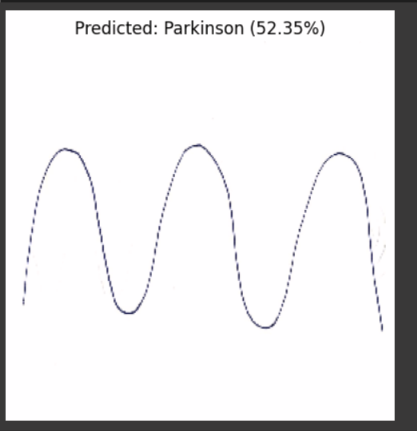

# 🧠 Parkinson's Disease Detection Using ResNet50

This project detects Parkinson’s Disease from hand-drawn spiral and wave images using a fine-tuned ResNet50 deep learning model.

---

## 📂 Dataset

The dataset is available for download here:
🔗 [Download Dataset (Google Drive)](https://drive.google.com/https://drive.google.com/file/d/1noBiUy_a-rJ_7GFrkV8ASLHqYLyM3bg0/view?usp=drive_link)

The dataset includes spiral/wave drawings from:
- **Healthy individuals**
- **Patients with Parkinson’s Disease**

Expected structure:

```
Dataset/
├── Healthy/
│   ├── healthy1.jpg
│   └── ...
└── Parkinson/
    ├── parkinson1.jpg
    └── ...
```

---

## 🧪 Model

- **Base Model**: ResNet50 (fine-tuned)
- **Input Size**: 256x256
- **Techniques**: Data Augmentation, Transfer Learning
- **Accuracy Achieved**: XX% *(update after training)*

---

## 📊 How to Run

```bash
# Step 1: Install dependencies
pip install -r requirements.txt

# Step 2: Run the script
python main.py
```

---

## 📈 Output Example



---

## 📬 Prediction

The script supports uploading a new image (spiral or wave) and returns:
- The predicted class (Healthy / Parkinson)
- Confidence score (e.g., 92.45%)

---

## 📜 License

MIT
